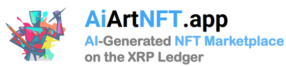
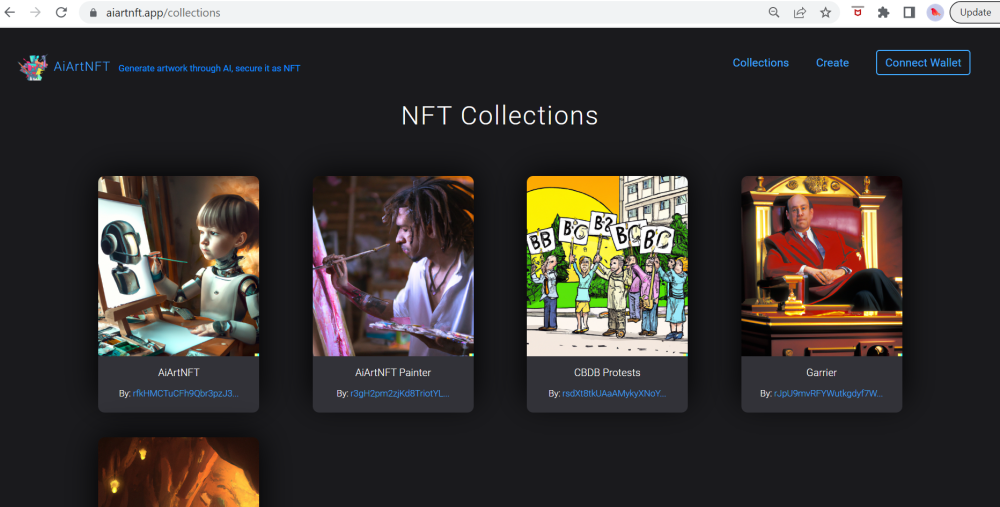
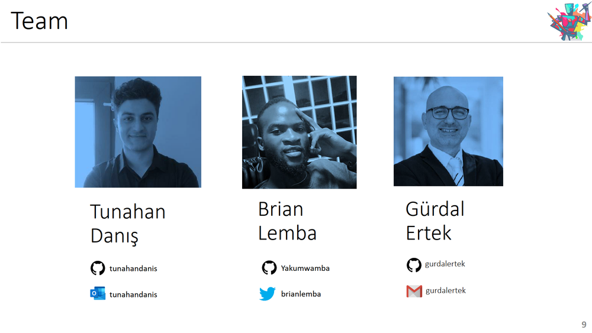

 

## Generate artwork through AI, secure it as NFT

Welcome to the home page of the AiArtNFT dapp.

<hline>
</hline>

## Start Here:

- [**AiArtNFT Dapp**](https://www.aiartnft.app/) is running live on the cloud.
- [**Slide Deck**](https://heyzine.com/flip-book/f365cb1514.html describes the project and the dapp.
- [**YouTube Video**](https://youtu.be/guELHaItI8Q) is the demo video for the hackathon.

## Executive Summary
  
**[AiArtNFT.app](https://AiArtNFT.app)** is an **NFT marketplace with built-in Generative AI system,** that **generates art from text**, using **OpenAI's DALL-E API**, and enables the selection of the generated image and immediate placement of that image into an NFT marketplace. 

**Novelty** is that, while  it is possible to find many text-to-image generation web services  and many NFT marketplaces, to the best of our knowledge, there are only two Web 3 dApps, as hackathon projects that **integrate AI art generation with NFT marketplace.**

The app was designed, developed, and implemented during the period of [XRPL Hackathon: NFT Launch Party](https://xrplnft.devpost.com/) by the project team. 

## AiArtNFT Screenshots

## AiArtNFT Team

- [Tunahan Danis](https://github.com/tunahandanis) (Frontend development, Backend development, Web 3.0)

_Istanbul, Turkey_

- [Brian Lemba](https://github.com/Yakumwamba) (AI Generation, Web3/IPFS, Blockchain/XRP Integration, Backend development)

_Johannesburg, South Africa_

- [Gurdal Ertek](https://github.com/gurdalertek) (Product design, Content curation, Documentation, Project management)

_Al Ain, United Arab Emirates_

<!--- Member of [BlockBlockData](https://blockblockdata.com) Team; Associate Professor of Business Analytics, [UAE University](https://cbe.uaeu.ac.ae/en/departments/analytics/) --->

